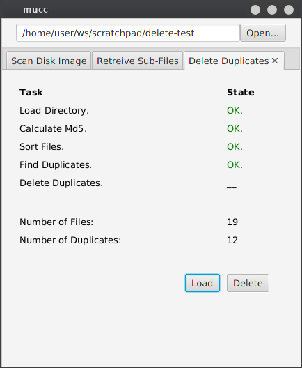

### Table of Contents
1. [About](#about)
2. [Getting Started](#getting-started)
3. [Description](#description)
4. [Package Contents](#package-contents)
5. [Issues](#issues)
6. [Screenshot](#screenshot)

### About  
mucc is a tool for processing data recovered by scalpel. 
It's features include:
1. Splitting PDF files into sub-files.
2. Deleting duplicate files, which can be used independently. 

 
 

### Getting Started  
* Download and extract the [JavaFX SDK](https://gluonhq.com/products/javafx/).
* Add the `<your path>/javafx-sdk-11/lib/`as a library to your project.
* Add `--module-path <your path>/javafx-sdk-11/lib --add-modules=javafx.controls,javafx.fxml` to VM options.
* Run

 
 

### Description  

##### Retrieving Sub-Files

scalpel parses disk images for %PDF headers 
and %EOF footers.
If max_filsize is set high, the generated files will often consist of several
concatenated sub-files.
Here mucc finds the nested %PDF and %EOF tags 
and returns the files with byte sized precision.

##### Deleting Duplicates
Here mucc calculates the md5 hash of each file and deletes the identical files.

 
 

### Package Contents  

| Class         | Description |
|---------------|-------------|
| Artifacts     | Simple objects used by other classes.|
| Controller    | JavaFX class containing application logic. |
| Execute       | Issues shell commands.|
| layout.fxml   | Contains layout data.|
| Main          | Main JavaFX class. Run from here.|
| QuicksortMd5  | Quicksort algorithm.|
| routines      | Contains higher level routines called by Controller.|
| Tools         | Simple tools used by other classes.|
| Write         | Writes to /tmp. Used for data storage.|

 
 

### Issues  

- %PDF tags are not parsed correctly if cat output contains multiple tabs.
- Nested duplicates are not be deleted on first pass.
- Code formatting, documentation and IDE warnings. 
- `scalpel` integration is missing.
- States require progress indicator instead of "__".

 
 

### Screenshot  

